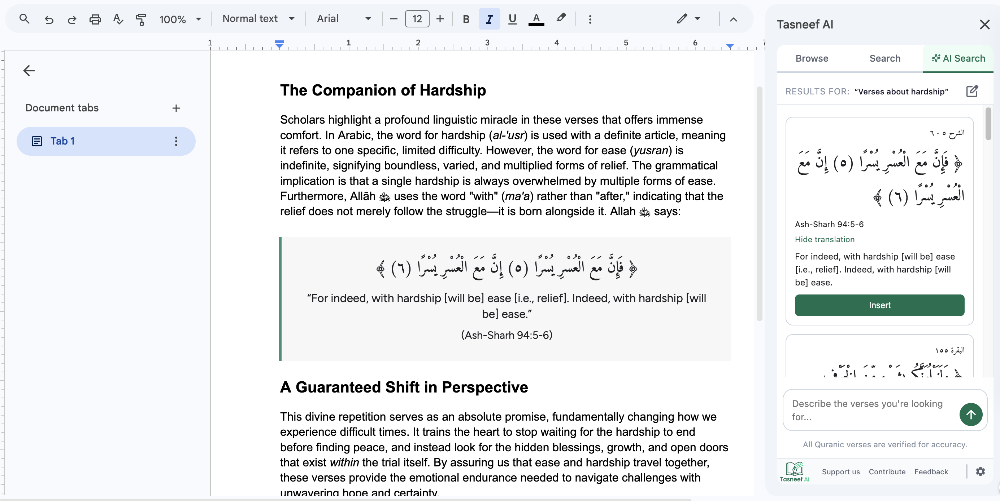
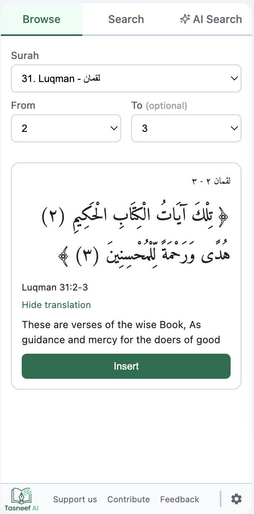
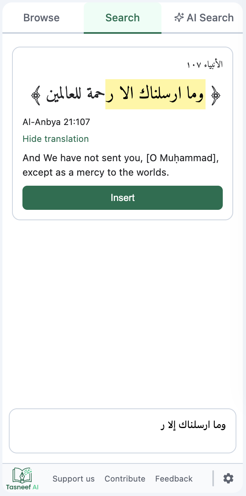
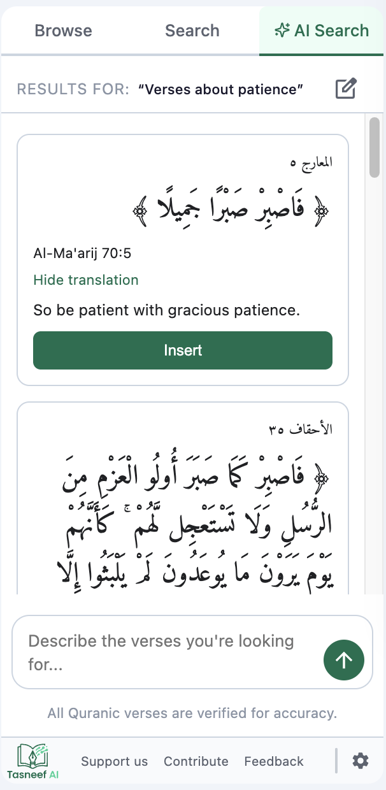
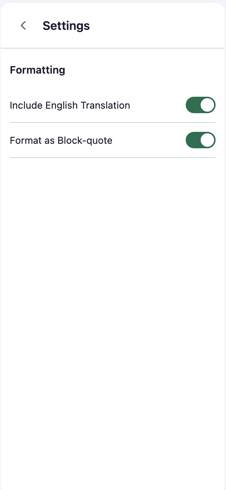

# Tasneef AI

A Google Docs sidebar add-on that lets you search and insert Quranic verses directly into Google Docs. Built for Islamic scholars, students, and writers who work with Quran references regularly.

Tasneef uses AI-powered semantic search to find verses by meaning, topic, or theme.



---

## Features

**Browse & Insert** — Select any surah and ayah range, preview the Arabic text and English translation, and insert directly into your document with one click.

<p align="center"></p>

**Exact Arabic Search** — Search the Quran by Arabic text with full diacritics normalization.

<p align="center"></p>

**AI Semantic Search** — Ask a question in natural language and get relevant ayahs ranked by meaning. Powered by a RAG pipeline with vector search and reranking.

<p align="center"></p>

**Configurable Settings** — Toggle translation display, and choose your insertion format.

<p align="center"></p>

---

## How It Works

1. **Quran data is loaded client-side** from hosted JSON data.
2. **AI search uses Claude as an intent classifier** — it determines what you're looking for, but never generates Quranic text.
3. **Semantic retrieval** uses OpenAI embeddings and Pinecone vector search, with Claude reranking for relevance.
4. **Every ayah reference is validated** against the local Quran dataset before display — hallucinated or invalid references are dropped silently.

---

## Tech Stack

- Google Apps Script (server)
- HTML / CSS / JavaScript (sidebar UI via HtmlService)
- Claude Haiku 4.5 (intent classification + reranking)
- OpenAI Embeddings (`text-embedding-3-small`)
- Pinecone (vector search)
- Quran data served from GitHub Pages (client-side caching)

---

## Installation

### From the Google Workspace Marketplace

*(Coming soon)*

### For development

1. Clone the repository:
   ```bash
   git clone https://github.com/tarazis/tasneef-ai.git
   cd tasneef-ai
   ```

2. Install dependencies:
   ```bash
   npm install
   ```

3. Set up [clasp](https://github.com/google/clasp):
   ```bash
   npm install -g @google/clasp
   clasp login
   ```

4. Create a new Apps Script project or link an existing one:
   ```bash
   clasp create --type standalone
   # or
   clasp clone <script-id>
   ```

5. Add required Script Properties in the Apps Script editor:
   - `claude_api_key` — Anthropic API key
   - `openai_api_key` — OpenAI API key
   - `pinecone_api_key` — Pinecone API key
   - `google_fonts_api_key` — Google Fonts Web API key for sidebar CSS requests (optional)
   - `dev_emails` — comma-separated emails to exempt from daily quota (optional)

6. Push and test (`.clasp.json` uses `"rootDir": "src"`):
   ```bash
   clasp push
   npm test
   ```

---

## Running Tests

```bash
# Full Node test suite
npm test

# Individual targets
npm run test:client
npm run test:normalize
npm run test:card
npm run test:font
npm run test:render-helpers
```

Apps Script tests live in `src/tests/` and run in the script editor via runner functions (`runClaudeAPITests`, `runDocumentServiceTests`, etc.). See `ARCHITECTURE.md` for details.

---

## Project Structure

Configuration and documentation stay at the repo root. The **Google Apps Script project** (everything clasp pushes) lives under **`src/`**. **Node** unit tests stay in root `tests/`; **Apps Script** tests are in `src/tests/` so they deploy with the script.

```
tasneef-ai/
├── .clasp.json              # scriptId, parentId, rootDir: "src"
├── package.json
├── tests/                   # Node tests (*.test.js) — npm test
├── src/                     # clasp project root (push target)
│   ├── appsscript.json
│   ├── Code.js              # Entry points (onOpen, showSidebar)
│   ├── ClaudeAPI.js         # AI search orchestration + RAG routing
│   ├── RagService.js        # Vector search, reranking, reference finalization
│   ├── DocumentService.js   # Ayah insertion into Google Docs
│   ├── FormatService.js     # Arabic typography enforcement
│   ├── SettingsService.js   # User settings + daily quota
│   ├── NormalizeArabic.js   # Arabic text normalization (server parity)
│   ├── RagEnglishTranslationSource.js
│   ├── client/              # Client-side shared modules
│   ├── sidebar/             # Sidebar UI (HTML, CSS, JS components)
│   └── tests/               # Apps Script tests (*.test.gs)
└── ...
```

See `ARCHITECTURE.md` for the full file tree, include order, and data flow documentation.

---

## Contributing

Contributions are welcome. Please open an issue first to discuss what you'd like to change.

1. Fork the repository
2. Create a feature branch (`feature/<issue-number>-description`)
3. Write tests for your changes
4. Ensure all tests pass (`npm test`)
5. Open a pull request referencing the issue

---

## Support

If you find Tasneef useful, consider supporting development:

Support on [Buy Me a Coffee](https://buymeacoffee.com/tarazis)

